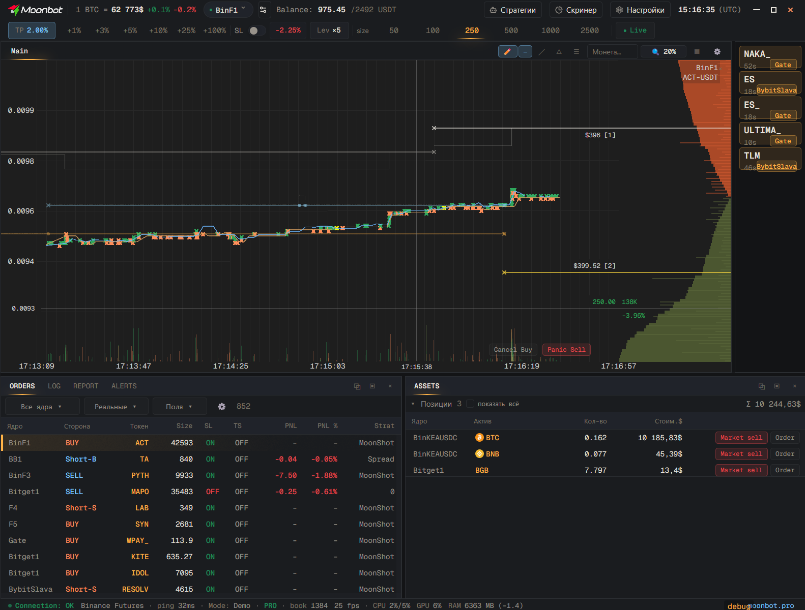
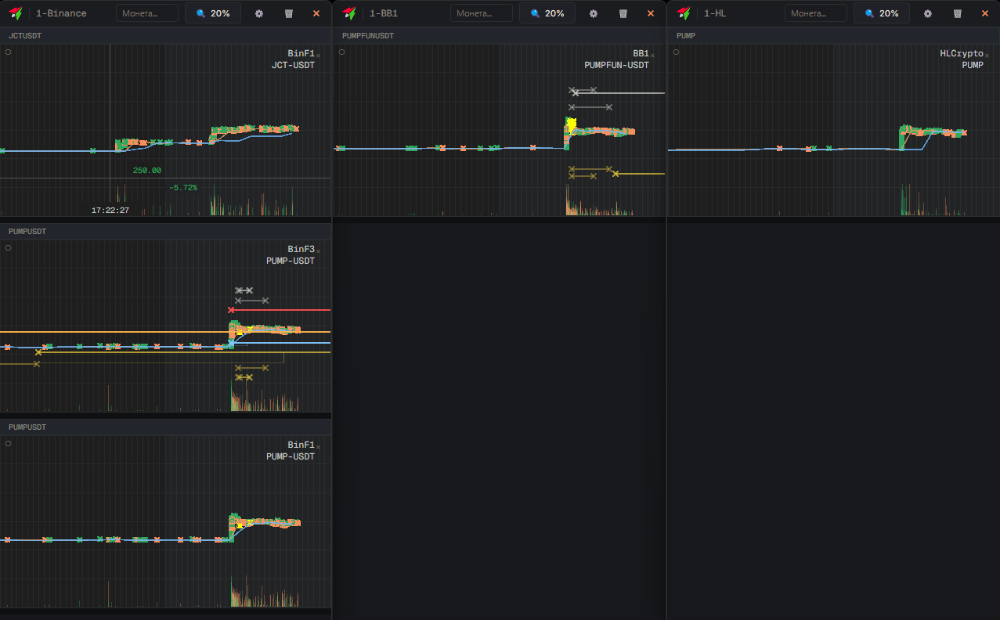
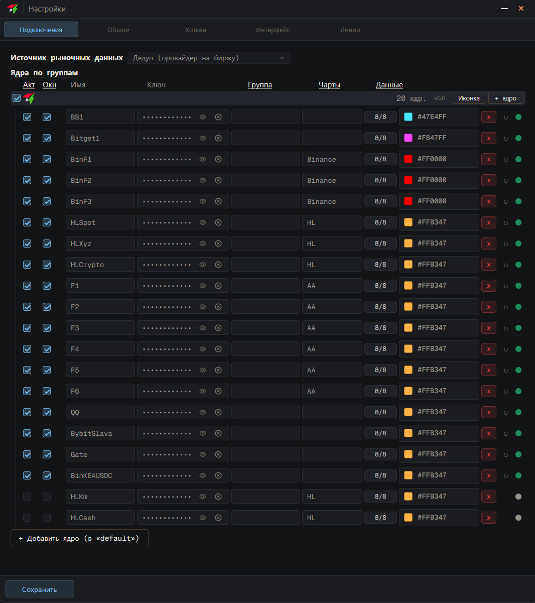

<p align="center">
  <a href="https://moonbot.pro">
    
  </a>
</p>

<h1 align="center">MoonTerminal</h1>

<p align="center">
  <b>Cross-platform desktop trading terminal for the Moonbot kernel</b><br>
  GPU-rendered charts · live MoonProto feed · Windows · macOS · Linux
</p>

<p align="center">
  <a href="https://github.com/Moonbot-Tech/MoonTerminal/actions/workflows/build.yml"></a>
  <a href="https://github.com/Moonbot-Tech/MoonTerminal/releases"></a>
  
  
  
  
</p>

<p align="center">
  <a href="README.md">Русский</a> · <b>English</b>
  &nbsp;&nbsp;|&nbsp;&nbsp;
  <a href="#features">Features</a> ·
  <a href="#screenshots">Screenshots</a> ·
  <a href="#architecture">Architecture</a> ·
  <a href="#build">Build</a> ·
  <a href="#configuration">Configuration</a> ·
  <a href="#documentation">Documentation</a>
</p>

<p align="center">
  <a href="https://moonbot-tech.github.io/MoonTerminal/"><b>User guide</b></a> — an interactive tour of the terminal interface
</p>

MoonTerminal is a native desktop trading terminal for the **[Moonbot](https://moonbot.pro)** cryptocurrency-trading kernel. It renders live charts, order books, orders, reports, and strategies for one or more Moonbot cores from a single GPU-accelerated window on Windows, macOS, and Linux.

> **Work in progress.** This is the active development workspace for the terminal — a GPUI shell, MoonUI integration, the MoonProto live feed, per-platform GPU chart rendering, and debug tooling. It is not a finished, packaged product yet.

<p align="center">
  
</p>

## Features

- **GPU-rendered charts** — an own-pass GPU renderer on every platform (DirectX 11 on Windows, Metal on macOS, native `wgpu` on Linux). No CPU readback, so live scroll and zoom stay smooth without repainting the whole window.
- **Live MoonProto feed** — event-driven market data through a waker-based backend loop. The visible chart pulls data on the frame tick instead of constant polling.
- **Trading panels** — orders and order editing, order book, reports, assets & wallets, a market screener, and a strategy tree for your Moonbot cores.
- **Order lines on chart** — live order lines are built from the current snapshot plus captured events, so short terminal statuses (`Cancel` / `Fail` / `Done`) are never dropped.
- **Detachable multi-window layout** — chart tabs and dock panels pop out into separate windows; dock and layout state persist between sessions.
- **Localized UI** — Russian, English, and Spanish via `rust-i18n`.
- **Encrypted configuration** — server credentials are stored through the OS secure storage / keyring (Secret Service on Linux).
- **Desk-ready details** — alert sounds, coin icons, custom hotkeys and themes, plus a built-in `chart-smoke` FireTest probe that reports real chart bounds, native input, and CPU/GPU/RAM counters.

## Screenshots

<table>
  <tr>
    <td width="50%"></td>
    <td width="50%"></td>
  </tr>
  <tr>
    <td align="center"><sub>Chart workspace — GPU-rendered candles, order book, order lines</sub></td>
    <td align="center"><sub>Settings → Connections — per-core connection setup</sub></td>
  </tr>
</table>

## Architecture

MoonTerminal is a Rust virtual workspace built around a UI-agnostic core with the GPUI shell on top.

| Crate | Responsibility |
|---|---|
| [`moon-core`](crates/moon-core) | UI-agnostic kernel — connections, config, sessions, market state, reports. |
| [`moon-chart`](crates/moon-chart) | Chart math — time/price view, default scale, pan/zoom, axes (wgpu-free). |
| [`moon-ui-gpui`](crates/moon-ui-gpui) | The `moonterminal` binary — GPUI shell, panels, debug tooling, chart integration. |
| [`Moonbot-Tech/MoonUI`](https://github.com/Moonbot-Tech/MoonUI) | External Git dependency — standalone GPUI runtime + Moon UI components. |

**Rendering.** The chart draws through a dedicated GPU pass on top of MoonUI/GPUI — DX11/HLSL on Windows, Metal on macOS, the native GPUI `wgpu`/WGSL backend on Linux. The chart decides whether a frame is needed and prepares its data for that same frame, so the shell and order panels never repaint at live-scroll or mouse-move frequency.

**Data path.** MoonProto events arrive through an event sink with a waker; the backend loop wakes on real events and commands rather than a timer. The visible chart pulls market data on the frame tick, while a core-owned shared read-model serves the other consumers.

See the [architecture doc](docs/ARCHITECTURE.md) for the full picture.

## Build

### Clone

```bash
git clone https://github.com/Moonbot-Tech/MoonTerminal.git
cd MoonTerminal
```

### Windows

Requirements:

- Git
- Rust via `rustup`
- Visual Studio 2022 Build Tools with the C++ toolchain and Windows SDK
- Optional: `make`

```powershell
cargo build -p moon-ui-gpui --bin moonterminal --target x86_64-pc-windows-msvc
```

Debug executable:

```text
target\x86_64-pc-windows-msvc\debug\moonterminal.exe
```

### macOS

Requirements:

- Xcode or a working Metal toolchain
- Rust via `rustup`

```bash
cargo build -p moon-ui-gpui --bin moonterminal
```

For canonical Metal validation see the [macOS & Linux build guide](docs/MAC_LINUX_BUILD.md).

### Linux

Ubuntu/Debian baseline:

```bash
sudo apt update && sudo apt install -y git build-essential pkg-config \
  libfontconfig-dev libwayland-dev libxkbcommon-dev libvulkan-dev libssl-dev
```

```bash
cargo build -p moon-ui-gpui --bin moonterminal
```

The Linux encrypted config uses Secret Service in the user GUI/DBus session. Details in the
[macOS & Linux build guide](docs/MAC_LINUX_BUILD.md).

### Common commands

| Command | Purpose |
|---|---|
| `make run` | build and run the debug terminal |
| `make build` | debug build |
| `make release` | release build |
| `make check` | type check |
| `make fmt` | `cargo fmt` |
| `make clean` | clean `target` |
| `make update-moon-ui` | move the MoonUI pin in the committed `Cargo.lock` |
| `make update-moonproto` | move the MoonProto pin (its own deliberate commit) |
| `make update-all` | move EVERYTHING including the pinned forks — lifts the version freeze |

The Makefile selects the MSVC target on Windows and the native target on macOS/Linux.

## Configuration

Servers are configured in the application UI:

```text
Settings → Connections
```

Per-core connection setup — see the [Settings → Connections screenshot](#screenshots) above.

Runtime config lives next to the executable. Server credentials are stored in encrypted config using the OS secure storage / keyring where available. Local config files and logs are ignored by Git.

## Documentation

| Guide | What's inside |
|---|---|
| [User guide](https://moonbot-tech.github.io/MoonTerminal/) | Interactive tour: the main-window map, first connection, panels, hotkeys |
| [Architecture](docs/ARCHITECTURE.md) | Crates, per-platform GPU rendering, and the live data path |
| [FireTest](docs/FIRETEST.md) | The built-in `chart-smoke` live probe |
| [macOS & Linux build](docs/MAC_LINUX_BUILD.md) | Metal validation and Linux setup |
| [Windowing](docs/WINDOWING.md) | Custom title bar and borderless/CSD behavior |

---

<p align="center">
  Moonbot · Advanced terminal for cryptocurrency trading · <a href="https://moonbot.pro">moonbot.pro</a>
</p>
